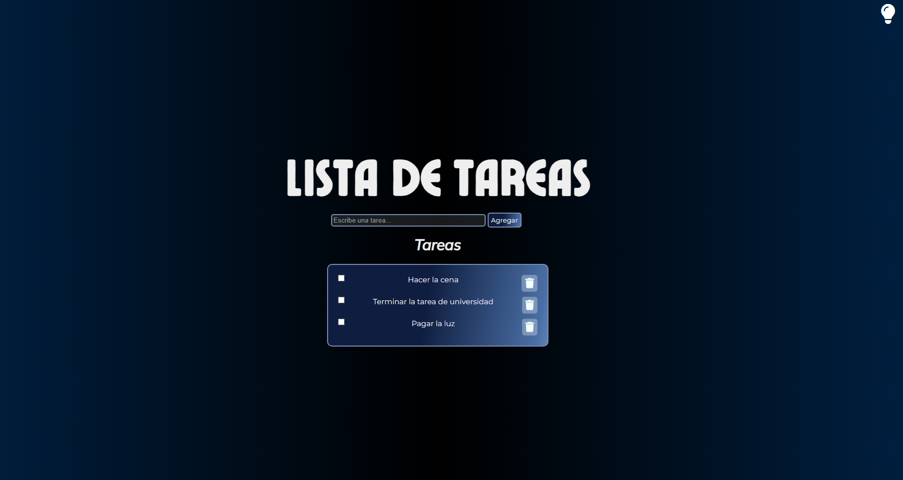
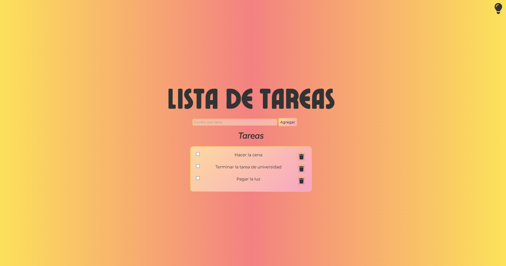

# 📝 To Do List

Una aplicación web simple e intuitiva para gestionar tareas diarias. Los usuarios pueden agregar, tachar y eliminar tareas, con almacenamiento en el navegador mediante `localStorage`. También incluye un botón para alternar entre modo claro y oscuro.

## 📸 Vista previa

![Captura de pantalla del proyecto]
  


---

## ⚙️ Tecnologías utilizadas

- HTML5  
- CSS3  
- JavaScript (vanilla)  
- [Font Awesome](https://fontawesome.com/) para íconos  

---


## 📂 Estructura del proyecto

```
todo-list/
│
├── index.html          # Página principal
├── style.css           # Estilos
├── fonts.css           # Fuentes
├── main.js             # Lógica de la app
├── img/
│   └── icon.png        # Ícono de la app
│   └── modonoche.png   # Captura en Modo Noche 
│   └── mododia.png     # Captura en Modo Dia 
```

---

## 💡 Funcionalidades

- ✅ Agregar nuevas tareas  
- ✅ Marcar tareas como completadas  
- ✅ Eliminar tareas  
- ✅ Guardado automático en el navegador (localStorage)  
- ✅ Alternar entre modo día y noche  

---

## 📌 Detalles técnicos

- Las tareas se guardan en el navegador, por lo que no se pierden al cerrar o recargar la página.
- El cambio de modo (claro/oscuro) se aplica mediante la clase `.modo-dia` al `<body>`.

---

## 📄 Licencia

Este proyecto es de uso libre para fines educativos o personales. Si lo vas a reutilizar públicamente, te agradecería que menciones al autor original. 😊

---

## ✍️ Autor

Desarrollado por **Stefania Ayelén**.